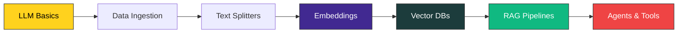

<div align="center">

# GenAI Learning Lab

### My hands-on journey through LangChain, LLMs, Embeddings & Vector Databases

[](https://www.python.org/)
[](https://www.langchain.com/)
[](https://jupyter.org/)
[](https://huggingface.co/)
[](https://openai.com/)
[](https://ollama.com/)


</div>

---

## About

> A growing collection of notebooks where I break down **Generative AI** concepts one piece at a time — from talking to LLMs, to chunking documents, to building searchable vector indexes with FAISS and Chroma.
>
> Think of it as a **lab notebook**, not a polished product. Every folder is an experiment.

---

## Roadmap



---

## What's Inside

<details open>
<summary><b>1 · LangChain Fundamentals</b></summary>

| Module | Topic | Status |
|--------|-------|:------:|
| `1.1-OpenAi` | Talking to OpenAI models via LangChain | Pending |
| `1.2-Ollam`  | Local LLMs with Ollama | Pending |

</details>

<details open>
<summary><b>3 · Data Ingestion & Chunking</b></summary>

| Notebook | Covers |
|----------|--------|
| `3.2-Dataingetion.ipynb` | Loading PDFs, web pages, Arxiv, Wikipedia |
| `3.3-textspillter.ipynb` | Recursive character text splitter |
| `3.4-characterSpilitter.ipynb` | Character-level splitting strategies |

</details>

<details open>
<summary><b>3.4 · Embeddings</b></summary>

| Notebook | Covers |
|----------|--------|
| `embedding.ipynb` | OpenAI embeddings |
| `ollama-embedding.ipynb` | Local embeddings via Ollama |

</details>

<details open>
<summary><b>4 · Hugging Face Integration</b></summary>

| Notebook | Covers |
|----------|--------|
| `huggingface.ipynb` | Using HF models & `sentence-transformers` inside LangChain |

</details>

<details open>
<summary><b>5 · Vector Databases</b></summary>

| Notebook | Covers |
|----------|--------|
| `5.1-FaissDB.ipynb` | Building & querying a FAISS index |
| `5.2-chromadb.ipynb` | Persistent storage with ChromaDB |

</details>

---

## Tech Stack

<table>
<tr>
<td valign="top" width="33%">

### LLMs
- OpenAI GPT
- Ollama (local)
- Hugging Face

</td>
<td valign="top" width="33%">

### Embeddings
- `text-embedding-3-small`
- `sentence-transformers`
- Ollama embeddings

</td>
<td valign="top" width="33%">

### Vector Stores
- FAISS
- ChromaDB

</td>
</tr>
<tr>
<td valign="top">

### Loaders
- `pypdf` / `pymupdf`
- `bs4` (web)
- `arxiv`
- `wikipedia`

</td>
<td valign="top">

### Splitters
- Recursive Character
- Character
- Token-based

</td>
<td valign="top">

### Tooling
- Jupyter
- python-dotenv
- ipykernel

</td>
</tr>
</table>

---

## Quick Start

```bash
# 1. Clone
git clone https://github.com/akashissu/GenAi-Learninga.git
cd GenAi-Learninga

# 2. Create virtual environment
python -m venv .venv
source .venv/bin/activate          # macOS / Linux
# .venv\Scripts\activate           # Windows

# 3. Install dependencies
pip install -r requirements.txt

# 4. Configure secrets
cp .env.example .env
# then open .env and add your API keys

# 5. Launch Jupyter
jupyter notebook
```

> [!TIP]
> Running locally with **Ollama**? Install it from [ollama.com](https://ollama.com) and pull a model first:
> ```bash
> ollama pull llama3
> ollama pull nomic-embed-text
> ```

---

## Required Environment Variables

| Variable | Used for | Required |
|----------|----------|:--------:|
| `OPENAI_API_KEY` | OpenAI LLMs & embeddings | If using OpenAI |
| `GROQ_API_KEY` | Groq inference | Optional |
| `HF_TOKEN` | Gated Hugging Face models | Optional |
| `LANGCHAIN_API_KEY` | LangSmith tracing | Optional |

> [!WARNING]
> Never commit your `.env` file. It's already in `.gitignore` — keep it that way.

---

## Progress Tracker

- [x] Project scaffolding & environment setup
- [x] Data ingestion (PDF, web, Arxiv, Wikipedia)
- [x] Text splitting strategies
- [x] OpenAI & Ollama embeddings
- [x] FAISS vector store
- [x] ChromaDB vector store
- [ ] End-to-end RAG pipeline
- [ ] Conversational memory
- [ ] Agents & tool calling
- [ ] LangGraph workflows
- [ ] Deploying with FastAPI

---

## Connect

<div align="center">

[](https://github.com/akashissu)

⭐ **Star this repo if it helps you learn too!**

</div>

---

<div align="center">
<sub>Built with curiosity, caffeine, and the occasional <code>pip install</code> regret.</sub>
</div>
